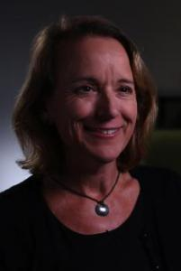
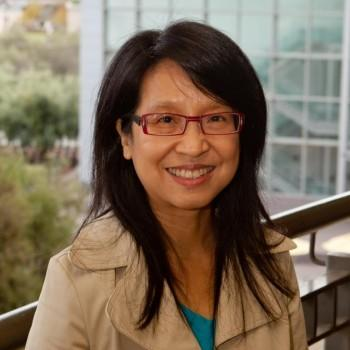
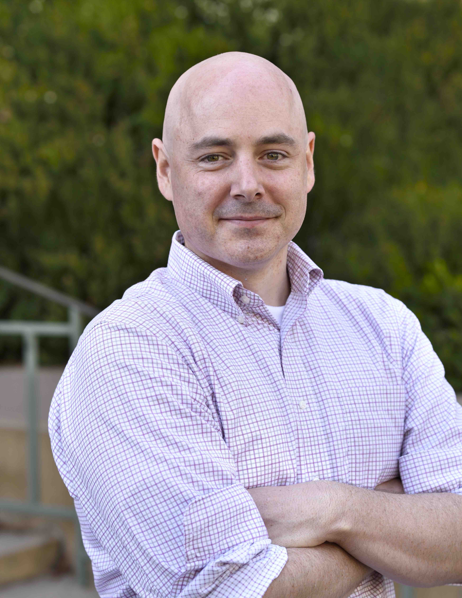
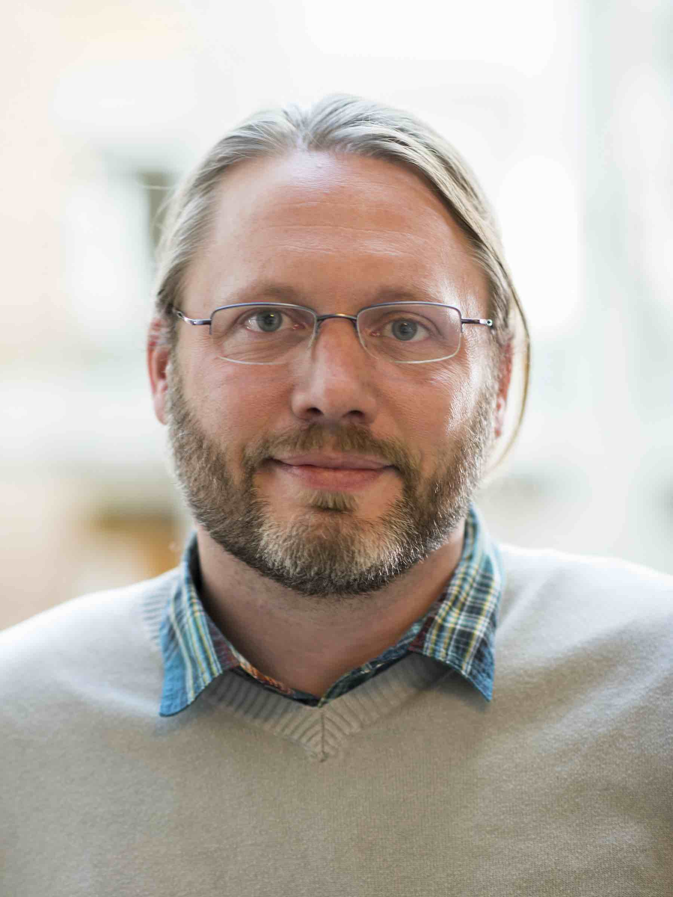

# Invited Speakers
+ [Xin Luna Dong](http://lunadong.com/)  (Amazon)
+ [Lise Getoor](https://getoor.soe.ucsc.edu/)  (University of California Santa Cruz)
+ [Alon Halevy](https://homes.cs.washington.edu/~alon/)  (Recruit Institute of Technology)
+ [Monica Lam](https://suif.stanford.edu/~lam/)  (Stanford University)
+ [Christopher Ré](https://cs.stanford.edu/people/chrismre/)  (Stanford University)
+ [Xifeng Yan](http://www.cs.ucsb.edu/~xyan/)  (University of California at Santa Barbara)
+ [Luke Zettlemoyer](https://www.cs.washington.edu/people/faculty/lsz)  (University of Washington)

 

# Speaker Bio (coming soon)

 [Xin Luna Dong](http://lunadong.com/)  (Amazon)

Xin Luna Dong is a Principal Scientist at Amazon, leading the efforts of constructing Amazon Product Knowledge Graph. She was one of the major contributors to the Google Knowledge Vault project, and has led the Knowledge-based Trust project, which is called the "Google Truth Machine" by Washington's Post. She has co-authored book "Big Data Integration", published 70+ papers in top conferences and journals, and given 30+ keynotes/invited-talks/tutorials. She got the VLDB Early Career Research Contribution Award for advancing the state of the art of knowledge fusion, and got the Best Demo award in Sigmod 2005. She is the PC co-chair for Sigmod 2018 and WAIM 2015, and serves as an area chair for Sigmod 2017, CIKM 2017, Sigmod 2015, ICDE 2013, and CIKM 2011.

 

 [Lise Getoor](https://getoor.soe.ucsc.edu/)  (University of California Santa Cruz)

 
 

 [Alon Halevy](https://homes.cs.washington.edu/~alon/)  (Recruit Institute of Technology)

 
 

 [Monica Lam](https://suif.stanford.edu/~lam/)  (Stanford University)

 
 

 [Christopher Ré](https://cs.stanford.edu/people/chrismre/)  (Stanford University)

 
 

 [Xifeng Yan](http://www.cs.ucsb.edu/~xyan/)  (University of California at Santa Barbara)

 
 

 [Luke Zettlemoyer](https://www.cs.washington.edu/people/faculty/lsz)  (University of Washington)

 
